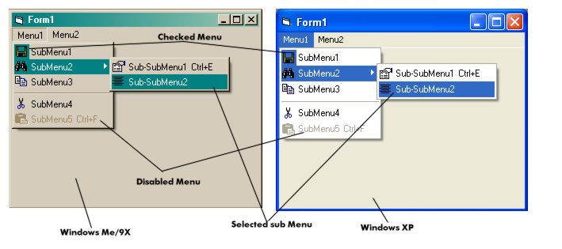



## A Great Menu with images / icons

### Description

This is my first upload to Planet-Source-Code, I wanted to help with any thing and because it is one of my favourite projects, I place it; I hope it would by helpful for you, it is not well explained but it is very easy to understand.

This is a control that put images (bmp, jpg, gif...) or icons (ico, cur...) in a menu or in a sub menu, it was proved in Windows ME / 9X and in Windows XP / NT (See the ScreenShot), it have an user control, an OCX, two projects (The menu control and the test), and a group, that is the one that you have to open, this works with any windows ImageList or similar controls, and in any form with any number of menus, when you place the control in the form, you have to set its property of visible in false, because I could not use to InvisibleAtRunTime property in the user control because it crashes.

IMPORTANT:

To place the images into a menu or sub menu, you have to: first place a picture or icon in the ImageList, then in the key of the ImageList picture, you have to put the caption of the menu and with that, the control will place that image to that menu or sub menu, and the order does not matter in any thing.

All this is done in the test project.

Thanks, PLASE VOTE FOR IT, that is very important.
 
### More Info
 

             |
---                |---
**Submitted On**   |2002-07-07 08:51:08
**By**             |[Andrés F\. Gallo](https://github.com/Planet-Source-Code/PSCIndex/blob/master/ByAuthor/andr-s-f-gallo.md)
**Level**          |Advanced
**User Rating**    |4.5 (202 globes from 45 users)
**Compatibility**  |VB 4\.0 \(32\-bit\), VB 5\.0, VB 6\.0
**Category**       |[OLE/ COM/ DCOM/ Active\-X](https://github.com/Planet-Source-Code/PSCIndex/blob/master/ByCategory/ole-com-dcom-active-x__1-29.md)
**World**          |[Visual Basic](https://github.com/Planet-Source-Code/PSCIndex/blob/master/ByWorld/visual-basic.md)
**Archive File**   |[A\_Great\_Me103102772002\.zip](https://github.com/Planet-Source-Code/andr-s-f-gallo-a-great-menu-with-images-icons__1-36681/archive/master.zip)

### API Declarations

There are many, see the declaratinos in the code

